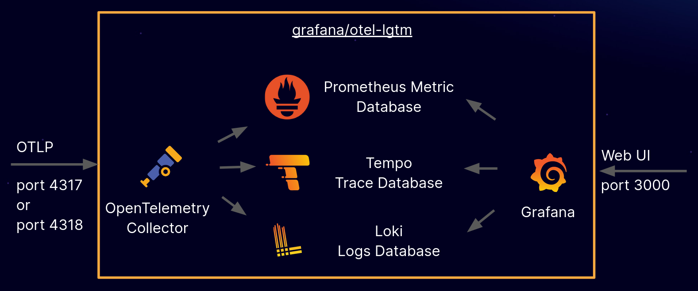

## springboot3 observability

目前能找到的比较成熟的springboot可观测方案，是grafana的LGTM方案。



* 对比传统的ELK方案，多了链路追踪，且使用loki存储日志比es存储更轻量；
* 对比skywalking来说，skywalking提供链路追踪、日志搜索、指标监控，是个正经的apm，但也就链路追踪还行，其他的两个功能现阶段比较鸡肋。（指标面板，日志搜索特别简易，个人感觉不是很好用）
* 采用标准化opentelemetry技术栈。这里需要注意下otel、otlp之间的区别。otlp是协议，按上图的架构图描述是缺少OpenTelemetry Collector这一层转换，也就意味着tempo、loki、prometheus得直接支持通过otlp协议的这种方式进行数据的接受或者写入。
[loki v3](https://github.com/grafana/loki/issues/5346)、[tempo](https://github.com/grafana/tempo/issues/1381)、[prometheus](https://horovits.medium.com/prometheus-now-supports-opentelemetry-metrics-83f85878e46a)
等较新的版本应该都可以支持，个人没进行验证。

### 准备工作，运行LGTM

```shell
docker run \
--name lgtm \
-p 3000:3000 \
-p 4317:4317 \
-p 4318:4318 \
--rm \
-ti \
-v $PWD/container/grafana:/data/grafana \
-v $PWD/container/prometheus:/data/prometheus \
-v $PWD/container/loki:/loki \
-e GF_PATHS_DATA=/data/grafana \
docker.io/grafana/otel-lgtm:latest
```


### springboot项目集成的两种方式

* 使用javaagent方式  
  `java -javaagent:path/to/opentelemetry-javaagent.jar -Dotel.service.name=your-service-name -jar myapp.jar`
* 使用sdk方式  
  参考该项目代码

> 参考：
>* https://github.com/grafana/docker-otel-lgtm.git
>* https://github.com/ashenwgt/springboot-observability-grafana-prometheus-tempo-loki.git
>* https://github.com/blueswen/spring-boot-observability.git
>* https://github.com/jufab/spring-opentelemetry-tracing
>* https://opentelemetry.io/docs/zero-code/java/spring-boot-starter